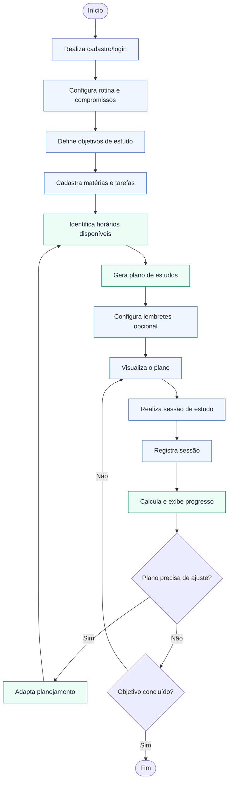

# Diagrama de Atividades

## Legenda

- **Azul:** ações do usuário.
- **Verde:** ações feitas automaticamente pelo sistema.

## Observações

- Os passos de configuração (rotina, objetivos, matérias) acontecem no primeiro uso. Nos acessos seguintes, o usuário segue direto para a visualização do plano.
- O sistema decide se o plano precisa de ajuste quando, por exemplo, uma sessão é pulada ou a rotina muda. Ao adaptar, ele recalcula os horários disponíveis e gera um novo plano.
- O progresso não é guardado no banco: é calculado a partir das sessões concluídas, como no diagrama de classes.
