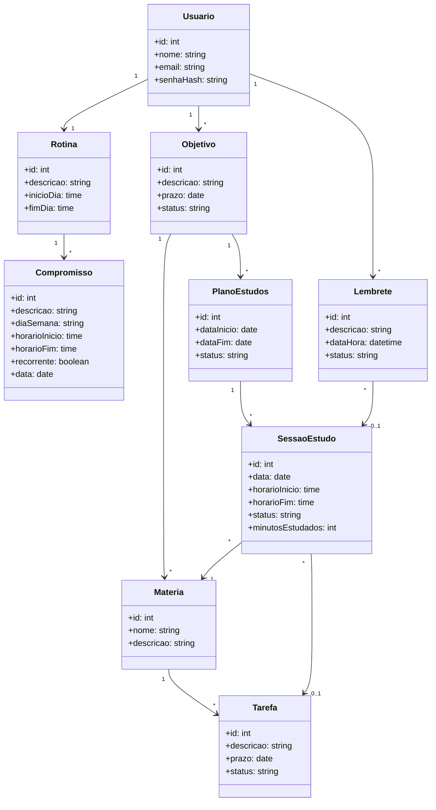

# Diagrama de Classes

## Observações

Cada caixa é uma **classe**, um tipo de informação que o sistema guarda (na prática, cada uma vira uma tabela do banco de dados). As setas mostram como elas se relacionam, e os números indicam quantidades: `1` significa um, `*` significa vários e `0..1` significa opcional. Por exemplo, `Objetivo "1" --> "*" Materia` quer dizer que um objetivo tem várias matérias.

## Visão geral

O diagrama pode ser lido em quatro partes:

- **Configuração:** o usuário tem uma rotina, que reúne seus compromissos, e define seus objetivos de estudo.
- **Conteúdo:** cada objetivo tem matérias, e cada matéria tem tarefas.
- **Planejamento e execução:** a partir de um objetivo, o sistema gera um plano de estudos, e o plano é composto por sessões de estudo.
- **Lembretes:** o usuário recebe lembretes, que podem estar ligados a uma sessão específica.

## Decisões de modelagem

- **Rotina e Compromisso:** a rotina guarda a janela do dia em que o usuário aceita estudar (`inicioDia` e `fimDia`). Os horários livres são calculados descontando os compromissos dessa janela. Um compromisso pode se repetir toda semana (`recorrente` e `diaSemana`) ou acontecer em uma data específica (`data`).
- **SessaoEstudo:** serve tanto para o que foi planejado quanto para o que foi feito. O campo `status` indica o estado da sessão (`planejada`, `concluida` ou `pulada`), e `minutosEstudados` só é preenchido ao registrar a sessão. A tarefa é opcional, porque dá para estudar uma matéria sem ter uma tarefa específica.
- **Progresso:** não é uma classe. Percentual e horas estudadas são calculados a partir das sessões concluídas, para nunca ficarem desatualizados.
- **Valores de `status`:** Objetivo, Tarefa e PlanoEstudos usam `pendente`, `em_andamento` e `concluido`. Lembrete usa `ativo` e `inativo`.
- **Senha:** o banco guarda apenas o hash da senha (`senhaHash`), nunca a senha original.
