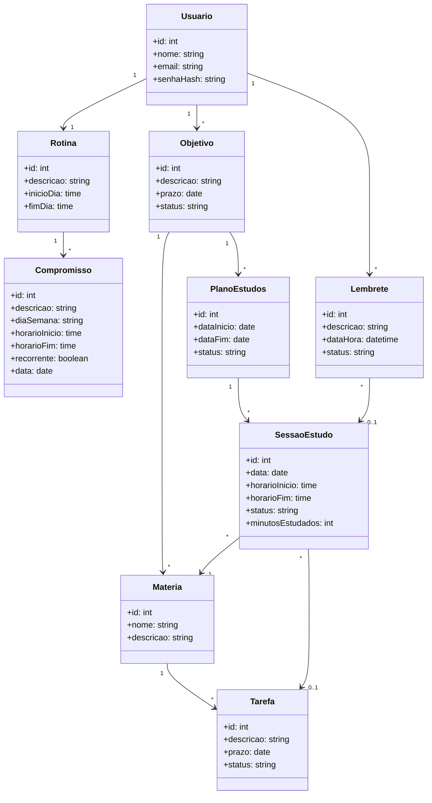

# Diagrama de Classes

```mermaid
classDiagram

    class Usuario {
        +id: int
        +nome: string
        +email: string
        +senhaHash: string
    }

    class Rotina {
        +id: int
        +descricao: string
        +inicioDia: time
        +fimDia: time
    }

    class Compromisso {
        +id: int
        +descricao: string
        +diaSemana: string
        +horarioInicio: time
        +horarioFim: time
        +recorrente: boolean
        +data: date
    }

    class Objetivo {
        +id: int
        +descricao: string
        +prazo: date
        +status: string
    }

    class Materia {
        +id: int
        +nome: string
        +descricao: string
    }

    class Tarefa {
        +id: int
        +descricao: string
        +prazo: date
        +status: string
    }

    class PlanoEstudos {
        +id: int
        +dataInicio: date
        +dataFim: date
        +status: string
    }

    class SessaoEstudo {
        +id: int
        +data: date
        +horarioInicio: time
        +horarioFim: time
        +status: string
        +minutosEstudados: int
    }

    class Lembrete {
        +id: int
        +descricao: string
        +dataHora: datetime
        +status: string
    }

    %% Configuração
    Usuario "1" --> "1" Rotina
    Rotina "1" --> "*" Compromisso
    Usuario "1" --> "*" Objetivo

    %% Conteúdo
    Objetivo "1" --> "*" Materia
    Materia "1" --> "*" Tarefa

    %% Planejamento e execução
    Objetivo "1" --> "*" PlanoEstudos
    PlanoEstudos "1" --> "*" SessaoEstudo
    SessaoEstudo "*" --> "1" Materia
    SessaoEstudo "*" --> "0..1" Tarefa

    %% Lembretes
    Usuario "1" --> "*" Lembrete
    Lembrete "*" --> "0..1" SessaoEstudo
```
