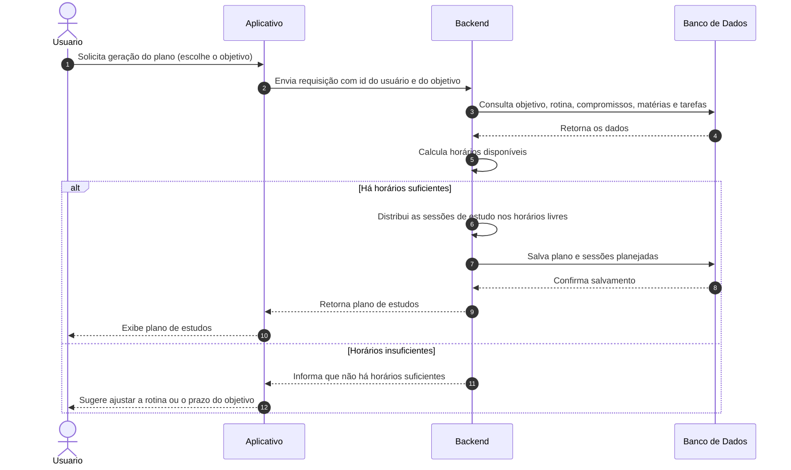

# Diagrama de Sequência: Gerar Plano de Estudos

## Observações

- Os dados de rotina, compromissos e objetivos já estão salvos no banco desde a configuração. Por isso o aplicativo envia só os identificadores, e o backend busca o resto.
- O plano salvo é composto por um `PlanoEstudos` e várias `SessaoEstudo` com status `planejada`, como no diagrama de classes.
- O mesmo fluxo vale para a adaptação do plano: o backend recalcula os horários e gera um novo plano.
